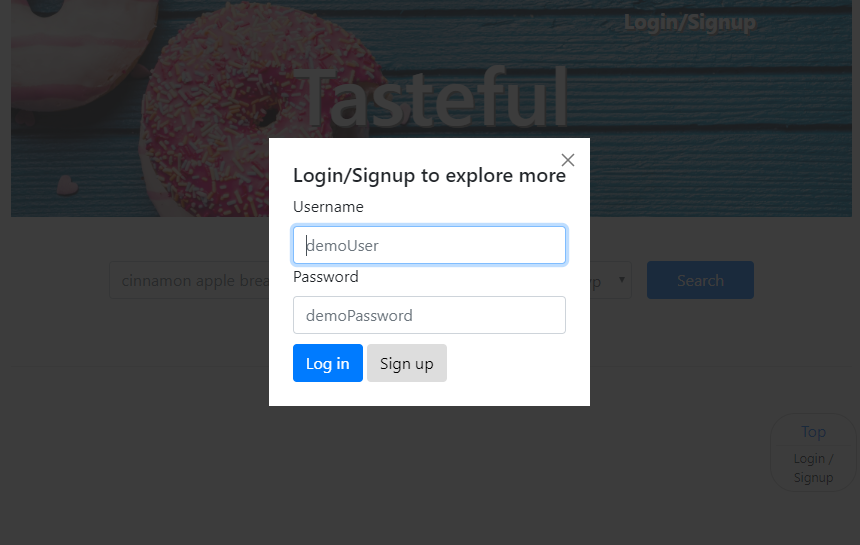
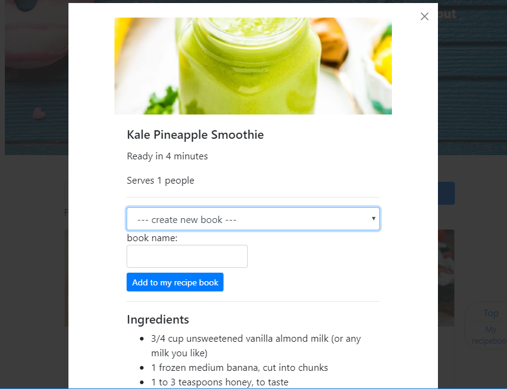
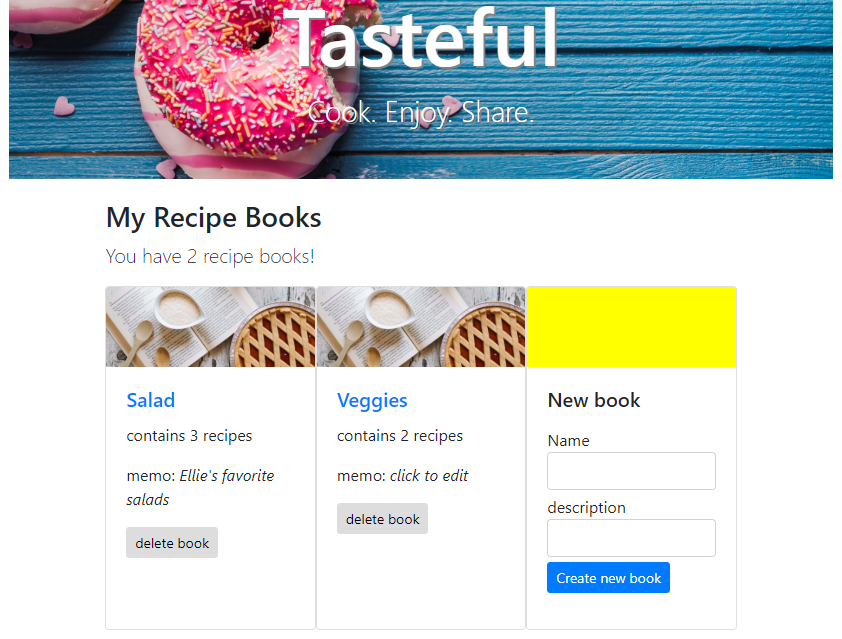
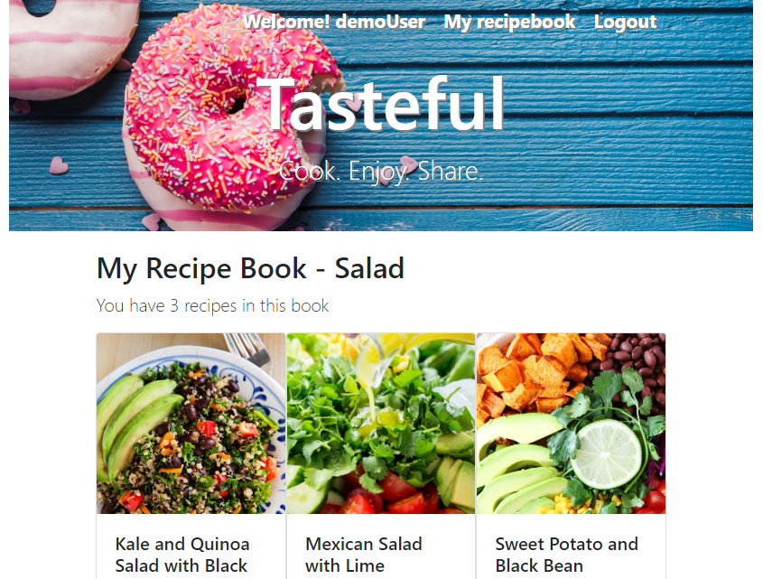

# Tasteful
Search from thousand of delicious recipes, add them into your personal recipebook, and make something tasteful!

To try this app live, visit [here](https://tasteful.herokuapp.com/).

## API Documentation
Endpoints on the server side include:
### '/' - index page
#### GET '/'
No data required in request. Render the index page with Handlebars template as response.
### '/users' - user registration
#### POST '/'
"username" and "password" are required in request body. Both parameters cannot start or end with white space, and password must be at least 4 characters and at most 72 characters long.
### '/auth' - user authentication
#### POST '/login'
Authentication of user login.
#### GET '/logout'
Logout a user and clear relavent cookies and sessionStorage.
#### GET '/logout/protected'
If the user was in a protected page before logout, call this endpoint so that a logout page would render to direct the user back to index page.
### '/recipes'
#### GET '/'
This endpoint will call a third-party api for recipe search. 
Request query may supply the following:

* page - a number, which page of the results user wants to load. A page contains 20 results
* cuisine - a string, acceptable values are 
* type - a string, type of meal, acceptable values are
* query - a string (comma separated), search text

Those parameters are optional. If leave blank, will return the most popular recipes by default.
No data returned explicitly as response but render a Hbs template page.
#### GET '/details'
This endpoint will call the third-party API to fetch detailed information of an recipe. An recipe ID is supplied behind the scene and a response rendered in page as lightbox content.
### '/recipe-books'
This endpoint displays protected information about user's personal recipebooks. User must login to access.
#### GET '/'
Get all books created by this user. An username is supplied behind the scene in the call.
#### GET '/book'
Request query supplies book Id behind the scene to fetch specific book.
#### POST '/'
Request body supplies book name and optionally recipes included and memo, to create a new book.
#### PUT '/book'
Request body supplies book Id behind the scene to edit specific book (add or delete recipes, change memo).
#### DELETE '/'
Request body supplies book Id to delete.

## How The App Looks Like
The use is self-explanatory. You do not need an account to search for recipes using search text, cuisine and meal types, and all three parameters are optional -- if leave blank, you receive the most trending recipes.

To add a personal recipebook, login/signup is required. Explore the app with a demo account:

username: demoUser
password: demoPassword

Click on the recipe you interested, a lightbox will pop out to show details of that recipe, and option to add to / create new recipebook for loggin user

You can then manage your recipebook to view book content, add new book, delet book, edit book memo.

Enjoy!

## Techniques and Resources Used in This Work
This is a Node.js project written in Express web framework (back-end) and with the help of jQuery (front-end). It supports CRUD and user authentication.

Database support is implemented with MongoDB and Mongoose. The online MongoDB Hosting provided by mLab is used in app deployment.

User authentication is implemented with Passport.js and JSON Web Tokens.

Both server-side and client-side templating are implemented with Handlebars.js.

This application also utilizes a third-party API for recipe search. The call to the outside API is done on server side using Request and Request Promise module.

Testing is implemented with Mocha/Chai/Chai-HTTP; Travis CI is used for Continuous Integration and Heroku for app deployment.
